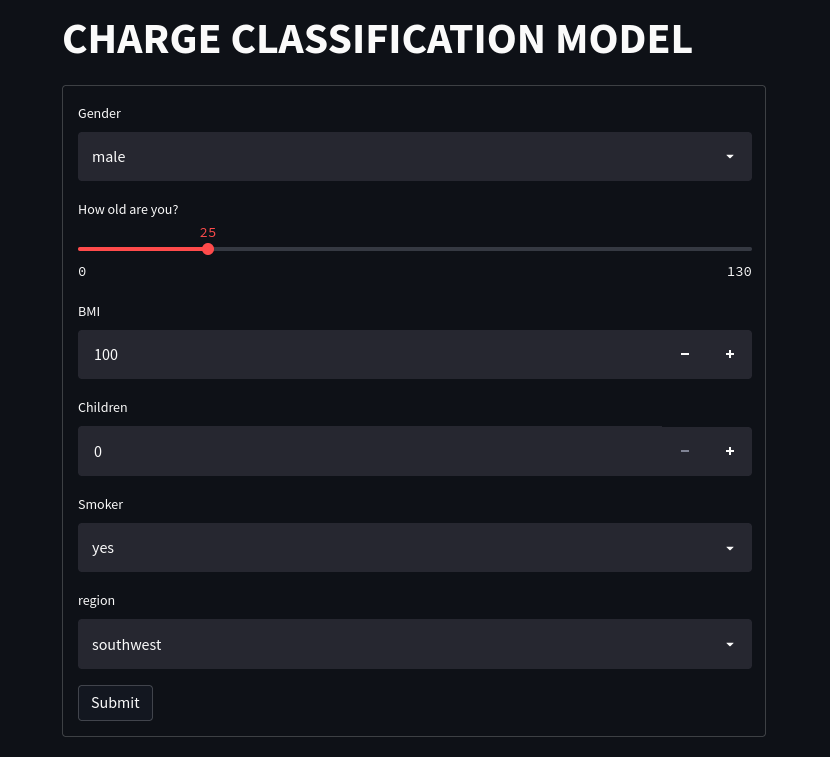

# MLOPS Pycaret

Criando um pipeline de treinamento e deploy com pycaret e streamlint

Este projeto sera hospedado no heroku para teste.

## Estrutura do Projeto

```
```

## Pagina para testar o modelo:



## Executando projeto

Dentro da pasta main, execute o scrit para o backend do modelo de classificacao ja
treinado

```
python3 main.py
```

Será executado um backend em fastapi, com uma api.

Depois para uma experiencia mais reativa, pode-se utilizar o front-end utilizando
o streamlint, executando o seguinte comando, dentro da pasta py_streamlit

```
streamlit run main.py
```